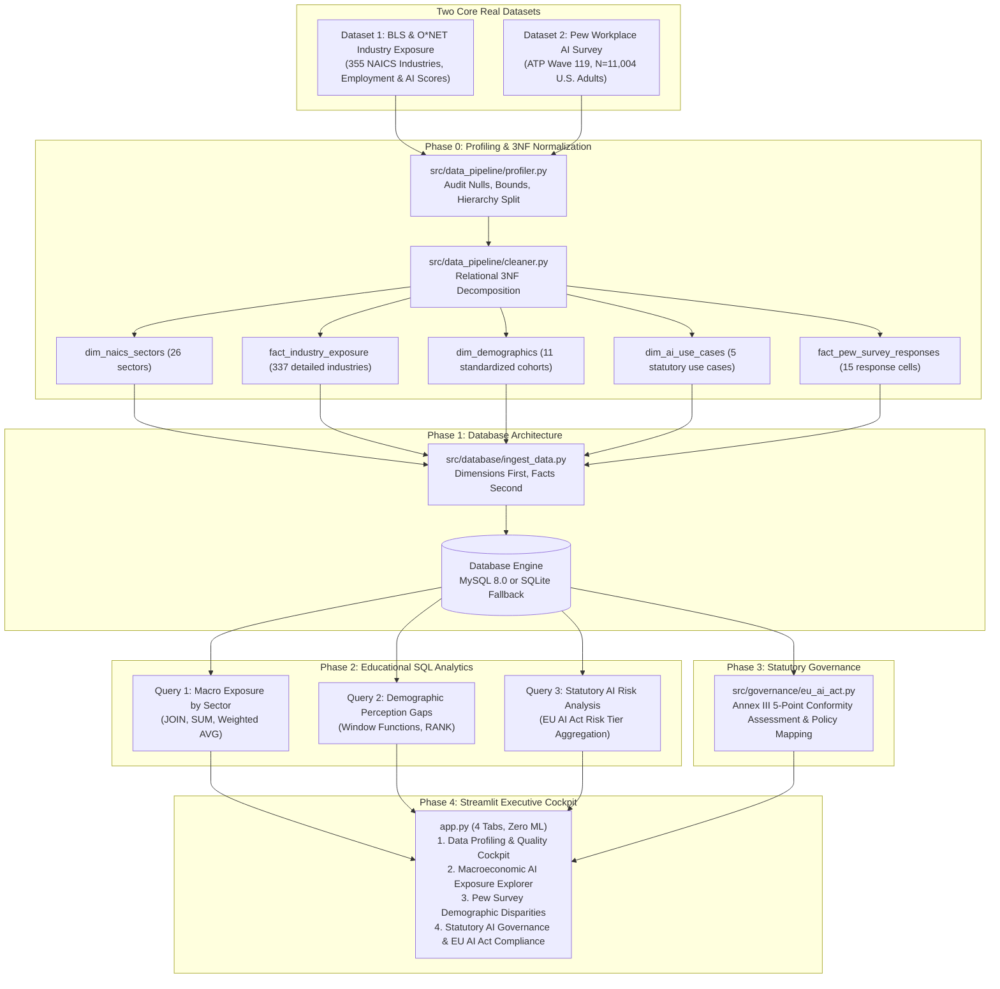

# WorkforceGuard Master Implementation Plan (Two-Dataset Edition)

> **Historical plan, partly superseded (Sep 2026 audit).** This is the original build plan, kept as written. Where it differs from the code, the code and [AUDIT_DOSSIER.md](AUDIT_DOSSIER.md) (v2, §8 "Changes Since v1") win. In particular:
> - Pew data now comes from ATP W119 microdata.
> - The schema has 6 tables, with no stored `exposure_tier` and a `counts_in_total` flag.
> - Monitoring maps to Annex III point 4(b), not Art. 50, and emotion analysis falls under Art. 5(1)(f).
> - MySQL is used only when `MYSQL_DATABASE_URL` is set.

## WorkforceGuard: Relational HR Analytics & Statutory AI Governance Engine

**Audience:** beginner-to-intermediate data analysts, HR analytics practitioners, and compliance engineers  
**Implementation style:** small, testable increments; explain every transformation; keep SQL and Python results reproducible  
**Primary deliverable:** a working Streamlit application backed by normalized MySQL 8.0 or zero-configuration SQLite  
**Strict Dataset Scope:** Exactly **TWO** real, published empirical datasets (zero synthetic data, zero extra applicant pools).

---

## 1. Executive Summary and Architectural Blueprint

WorkforceGuard turns **two real, published datasets** into an educational, transparent relational analytics and statutory governance system:

1. **Where is workplace AI automation exposure concentrated in the economy?**  
   Audits 355 NAICS industries using official Bureau of Labor Statistics (BLS) and O*NET empirical data, resolving the 18-parent-sector vs. 337-detailed-industry hierarchy trap to prevent double-counting.
2. **How do demographic cohorts perceive the fairness and acceptability of workplace AI?**  
   Analyzes representative probability survey data ($N = 11,004$ U.S. adults) from Pew Research Center (ATP Wave 119) across Gender, Race/Ethnicity, and Age cohorts for 5 workplace AI use cases.
3. **How do these workplace AI use cases map to statutory AI governance regulations?**  
   Evaluates each workplace AI use case against the **EU AI Act (Regulation EU 2024/1689 Annex III & Art. 50)** High-Risk Employment AI requirements and worker transparency mandates.

### Non-negotiable Scope Boundaries
- **Strictly Two Datasets**: Only `data/raw/real_bls_industry_ai_exposure.csv` and `data/raw/real_pew_ai_workplace_survey.csv`. No third candidate dataset to overwhelm the learner.
- **Zero Machine Learning**: No model training, no scikit-learn, no RandomForest, no train_test_split, no predictive regressions. 100% focused on Data Profiling, 3NF Database Design, Educational SQL, and Statutory Policy Auditing.

### Target Architecture

---

## 2. Phase 0: Data Context, Profiling, Cleaning & 3NF Normalization

### 2.1 The Two Real Datasets
1. **BLS & O*NET AI Occupational & Industry Exposure** (`data/raw/real_bls_industry_ai_exposure.csv`):
   - 355 rows covering all U.S. NAICS industries.
   - Measures 2024 covered employment and continuous routine cognitive task automation scores (`weighted_exposure` on $[0.0, 10.0]$).
   - **Hierarchy Trap**: 18 parent sectors (`is_sector == True`) vs. 337 granular industries (`is_sector == False`). Summing raw rows double-counts all workers! Segregated during cleaning into `dim_naics_sectors` and `fact_industry_exposure`.
2. **Pew Research Center Workplace AI Survey** (`data/raw/real_pew_ai_workplace_survey.csv`):
   - ATP Wave 119 national representative probability survey of $N = 11,004$ U.S. adults.
   - 15 empirical summary rows across 5 observed workplace AI use cases:
     1. AI in Hiring Decisions
     2. Automated Resume Screening
     3. AI Video / Facial Interview Analysis
     4. AI Workplace Productivity Surveillance
     5. AI Determining Job Promotions
   - Measures acceptability (`acceptable_pct`, `unacceptable_pct`) and perceived fairness vs. human evaluators (`fairer_than_humans_pct`, `less_fair_pct`, `equal_fairness_pct`) across Gender, Race/Ethnicity, and Age cohorts.

### 2.2 3NF Normalized Schema (Exactly 5 Tables)
- **`dim_naics_sectors`**: Lookup table of 2-digit parent industry sectors (`sector_code` PK, `sector_title`).
- **`fact_industry_exposure`**: Fact table of 6-digit detailed industries (`naics_code` PK, `parent_sector_code` FK, `industry_title`, `covered_employment`, `weighted_exposure`, `exposure_tier`).
- **`dim_demographics`**: Lookup table of standardized demographic cohorts (`demographic_id` PK, `demographic_name`, `dimension_type`).
- **`dim_ai_use_cases`**: Lookup table of workplace AI use cases (`use_case_id` PK, `use_case_name`, `statutory_risk_tier`, `risk_basis`).
- **`fact_pew_survey_responses`**: Fact table of empirical survey metrics (`response_id` PK, `use_case_id` FK, `demographic_id` FK, 5 percentage columns).

---

## 3. Phase 1: Database Architecture (MySQL 8.0 & SQLite Dual Mode)

- Canonical DDL in `src/database/schema_3nf.sql` with 5 relational tables, primary keys, foreign keys with `ON DELETE RESTRICT`, and covering indexes.
- Dual-mode connection manager in `src/database/connection.py` connecting to MySQL 8.0 if `WORKFORCEGUARD_DB_URL` is set, with zero-configuration fallback to local SQLite (`data/workforce_ai.db`).
- Ingestion script in `src/database/ingest_data.py` loading dimensions first, then facts, verifying exact row counts (26 sectors, 337 industries, 11 demographics, 5 use cases, 15 survey responses) and 0 orphan foreign keys.

---

## 4. Phase 2: Educational SQL Analytics Suite

Contained in `src/database/queries.py` with educational commentary:
1. **Query 1: Macro Exposure by 2-Digit Sector**:
   Computes employment-weighted exposure ($\sum(w \cdot x) / \sum w$) vs unweighted mean exposure. Verifies fact table sums match true workforce employment.
2. **Query 2: Pew Demographic Fairness Gap Analysis**:
   Computes net skepticism gap (`less_fair_pct - fairer_than_humans_pct`) and uses ANSI SQL window ranking (`RANK() OVER (PARTITION BY u.use_case_name, d.dimension_type ORDER BY ...)`) to rank demographic cohorts.
3. **Query 3: Statutory AI Risk Tier Aggregation**:
   Aggregates public acceptability and fairness perceptions grouped by EU AI Act statutory risk classification (`High-Risk Annex III` vs `Transparency Required Art. 50`).

---

## 5. Phase 3: Statutory AI Governance & Policy Mapping

Implemented in `src/governance/eu_ai_act.py`:
- Maps the 5 empirical workplace AI use cases from the Pew Survey to the statutory requirements of the **EU AI Act (Regulation EU 2024/1689 Annex III § 4 and Art. 50)**:
  - Recruitment & Selection (Hiring, Resume Screening, Video Interviewing) -> High-Risk Annex III § 4(a).
  - Worker Management & Promotion (Determining Job Promotions) -> High-Risk Annex III § 4(b).
  - Workplace Productivity Surveillance -> Transparency & Worker Notice Mandates under Art. 50.
- Evaluates the 5-point conformity assessment:
  1. Risk Management (Art. 9)
  2. Data Governance & Bias Testing (Art. 10)
  3. Technical Documentation & Logging (Arts. 11 & 12)
  4. Human Oversight & Appeal Mechanisms (Art. 14)
  5. Cybersecurity & Accuracy (Art. 15)

---

## 6. Phase 4: Streamlit Executive Cockpit (4 Core Tabs)

- **Tab 1: 🔬 Data Profiling & Quality Cockpit** (`src/ui/tab_profiling.py`):
  Data provenance, BLS hierarchy trap guard, interactive 3NF schema explorer for the 5 tables, quality gate badges.
- **Tab 2: 🌐 Macroeconomic AI Exposure Explorer** (`src/ui/tab_macro_exposure.py`):
  Live SQL Query 1 sector rankings, employment-weighted vs unweighted comparison, sub-industry drill-down, educational SQL inspector.
- **Tab 3: 📊 Pew Public Survey & Demographic Disparities** (`src/ui/tab_pew_survey.py`):
  Live SQL Query 2 fairness gap analysis, interactive use-case and dimension filters, window ranking, educational SQL inspector.
- **Tab 4: ⚖️ Statutory AI Governance & Policy Compliance** (`src/ui/tab_compliance_policy.py`):
  Statutory mapping of workplace AI use cases to EU AI Act Annex III and Art. 50, 5-point conformity checklist, downloadable compliance audit summary.

---

## 7. Phase 5: Automated Verification & Quality Gates

Automated test suite (`tests/`):
- `tests/test_data_quality.py`: Asserts BLS raw fingerprint, 3NF schema constraints, bounds ($[0, 10]$ exposure, $[0, 100]$ percentages), 0 orphan FKs, and 0 unhandled nulls.
- `tests/test_database.py`: Asserts schema creation, ingestion row counts (26 sectors, 337 detailed industries, 11 demographics, 5 use cases, 15 survey responses), 0 orphan joins, and `ON DELETE RESTRICT` enforcement.
- `tests/test_analytics.py`: Asserts live SQL execution for Query 1, Query 2, and Query 3 on the normalized database.
- `tests/test_governance.py`: Asserts EU AI Act statutory classification, 5-point conformity checklist, and policy remediation logic.
- `tests/test_no_ml_guard.py`: Asserts 0 machine learning dependencies in `src/` and `app.py`.
